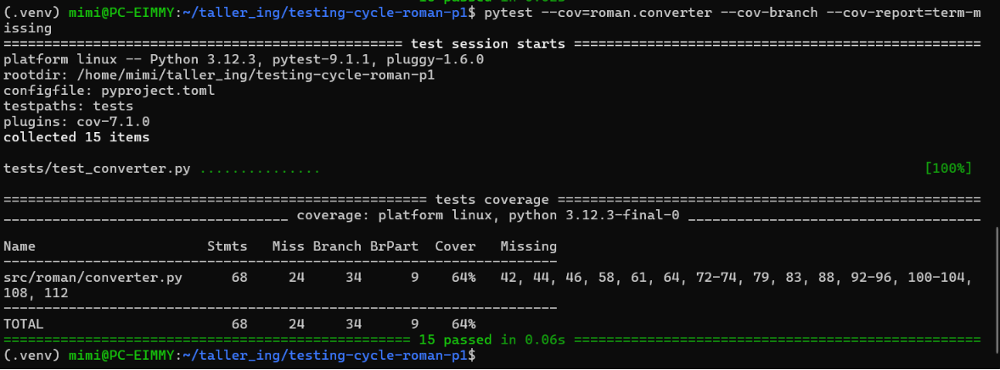
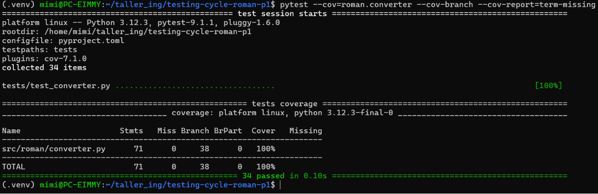

# Software Testing Life Cycle Report

## 1. Control Flow Graph of `to_roman`

---

## 2. Integration Finding

**Defect Revealed:**
When integrating `subtract_roman("I", "I")`, the internal execution correctly translates the strings to integers and performs the subtraction ($1 - 1 = 0$). However, when passing `0` to `to_roman`, the system crashes entirely by raising a `RomanError` (value out of range). The defect lies in the fact that `subtract_roman` propagates this unhandled exception instead of properly capturing it to return a value that `is_valid_roman` can safely evaluate and reject cleanly.

**Why Unit Tests Missed It:**
Unit tests evaluate `to_roman` and `from_roman` in complete isolation. The unit tests for `to_roman` purposefully inject invalid inputs (like 0) and pass because they *expect* the `RomanError` to be raised. They do not test what happens when that raised error travels upstream into another function's workflow. Therefore, the isolated paths pass flawlessly without revealing the architectural failure during integration.

---

## 3. Acceptance Criteria

**Criterion 1: Tolerating leading and trailing whitespace**
* **Given** a string representing a valid roman numeral that contains leading and trailing whitespace.
* **When** the string is processed by the `from_roman` function.
* **Then** the system must trim the whitespace before processing and successfully return the correct integer value without raising an error.

**Criterion 2: Rejection of non-canonical forms**
* **Given** a string that represents a valid mathematical value but uses a non-canonical format (e.g., "IIII").
* **When** the string is evaluated by the `from_roman` function.
* **Then** the system must reject the string and raise a `RomanError` immediately.

**Criterion 3: Lowercase input support**
* **Given** a valid canonical roman numeral written in lowercase letters.
* **When** the string is evaluated by the `from_roman` function.
* **Then** the system must process it interchangeably with uppercase letters and return the corresponding integer.

### Failed Criteria & Code Coverage Limitation
Criteria 1 and 2 initially **failed**, even when the system reported high structural branch coverage.

Code coverage metrics measure what percentage of the *existing written code* has been executed during the test suite. It cannot measure the **absence of logic**. Because the original developer never wrote the lines of code to call `.strip()` or to validate the repetition limits of canonical forms, the coverage tool had no branches to check for those features. This proves that 100% structural coverage does not guarantee that the functional requirements of the specification have been met.

---

## 4. Coverage

### Branch Coverage Before (Initial Audit)

### Branch Coverage After (Final Suite)

